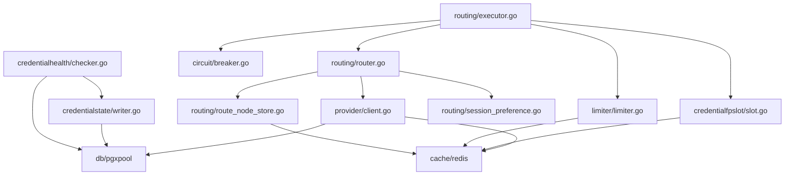

# 路由与状态管理重构 - 任务检查清单

**创建时间**: 2026-07-03
**状态**: 任务检查中
**负责人**: ACC团队

---

## 一、任务检查结果

### 1.1 现有代码结构分析

#### **核心模块识别**

```
现有模块分布:
├── routing/               # 路由决策层（18个核心文件）
│   ├── router.go         # 候选规划与排序
│   ├── executor.go       # 执行与故障转移
│   ├── route_node_state.go    # 节点状态管理
│   ├── route_node_store.go    # Redis持久化
│   ├── session_preference.go   # 会话偏好
│   └── sticky.go         # 客户端粘性
│
├── provider/             # 候选加载层
│   ├── client.go         # 候选查询与缓存
│   └── candidate.go      # 候选数据结构
│
├── credentialfpslot/     # 指纹槽位管理
│   ├── slot.go           # 主实现（1636行）
│   └── reclaim.go        # 后台回收
│
├── limiter/              # 并发限额管理
│   ├── limiter.go        # 四层限流器
│   └── redis_identity.go # 身份级并发跟踪
│
├── credentialstate/      # 凭据状态写入
│   └── writer.go         # 状态转换逻辑
│
└── credentialhealth/     # 健康检测
    ├── checker.go        # 持续失败检测
    └── anti_flap.go      # 防闪断机制
```

#### **重构边界识别**

✅ **可独立抽取的模块**:
1. `credentialfpslot/` → `routing-core/resource/fpslot/`
2. `limiter/` → `routing-core/resource/concurrency/`
3. `route_node_state.go` + `route_node_store.go` → `routing-core/state/node/`
4. `credentialstate/writer.go` → `routing-core/state/credential/`

⚠️ **需要重构的模块**:
1. `routing/router.go` - PlanCandidates 需要插入资源检查层
2. `routing/executor.go` - 资源获取逻辑需要统一到 ResourceManager
3. `provider/client.go` - 候选加载需要返回资源状态

❌ **暂不动的模块**:
1. `relay/` - 请求代理层（与路由解耦）
2. `upstream/` - 上游协议适配（与路由解耦）
3. `db/migrations/` - 数据库迁移（保持独立）

---

### 1.2 依赖关系分析



**关键依赖**:
- ❗ `executor.go` 强依赖 `router.go`、`credentialfpslot`、`limiter`
- ❗ `router.go` 强依赖 `provider.Client`、`RouteNodeStore`
- ❗ 所有模块都依赖 `Redis` 和 `PostgreSQL`

**重构风险**:
- 🔴 **高风险**: 修改 `executor.go` 和 `router.go` 的核心逻辑
- 🟡 **中风险**: 抽象 `credentialfpslot` 和 `limiter` 的接口
- 🟢 **低风险**: 新增独立模块（如 `CompositeScorer`、`ErrorClassifier`）

---

### 1.3 测试覆盖率检查

```bash
# 现有测试文件统计
routing/*_test.go:           23个测试文件
credentialfpslot/*_test.go:  10个测试文件
limiter/*_test.go:            2个测试文件
credentialstate/:             无独立测试
credentialhealth/:            无独立测试
```

**测试盲点**:
- ❌ `credentialstate/writer.go` - 状态转换逻辑无单元测试
- ❌ `credentialhealth/anti_flap.go` - 防闪断逻辑无单元测试
- ⚠️ 集成测试覆盖不足（特别是多层故障场景）

---

## 二、接口标准定义

### 2.1 ResourceManager 接口标准

```go
// routing-core/resource/manager.go
package resource

import (
    "context"
    "time"
)

// ResourceManager 统一管理指纹槽位和并发资源
type ResourceManager interface {
    // CheckEligibility 检查凭据的资源可用性
    // 返回详细的资源状态，用于路由决策
    CheckEligibility(ctx context.Context, req EligibilityRequest) (*EligibilityResult, error)
    
    // AcquireResources 原子获取指纹槽位和并发令牌
    // 返回 ReleaseFunc 用于释放资源
    AcquireResources(ctx context.Context, req AcquireRequest) (*AcquiredResources, ReleaseFunc, error)
    
    // GetResourceStats 获取凭据的资源统计信息
    GetResourceStats(ctx context.Context, credentialID int) (*ResourceStats, error)
    
    // CalculatePressure 计算资源压力（0.0-1.0）
    CalculatePressure(ctx context.Context, credentialID int) (float64, error)
}

type EligibilityRequest struct {
    CredentialID     int
    Holder           string  // Session ID / Request ID
    FpSlotLimit      *int    // 从数据库读取的配置
    ConcurrencyLimit int
}

type EligibilityResult struct {
    Eligible          bool
    FpSlotAvailable   bool
    ConcurAvailable   bool
    
    // 详细信息用于日志和监控
    FpSlotDetail      string  // "has_pin" | "free_slots:5" | "can_evict:slot_3"
    ConcurDetail      string  // "free:20/50" | "saturated"
    ResourcePressure  float64 // [0.0, 1.0]
    
    // 建议信息
    RecommendedAction string  // "proceed" | "retry_later" | "use_alternative"
}

type AcquireRequest struct {
    CredentialID      int
    ProviderID        int
    Model             string
    Holder            string
    FpSlotLimit       *int
    ConcurrencyLimit  int
    IdentityHash      string  // 终端用户标识
    KeyID             *int    // 可选的 API Key ID
    KeyConcurLimit    *int
}

type AcquiredResources struct {
    FpSlot       *FpSlotLease
    Concurrency  *ConcurrencyToken
    AcquiredAt   time.Time
}

type FpSlotLease struct {
    SlotIndex    int
    Egress       *EgressIdentity
    Unlimited    bool
    CredentialID int
}

type ConcurrencyToken struct {
    Global    bool
    Pool      bool
    Credential bool
    Identity  bool
}

type ReleaseFunc func(ctx context.Context) error

type ResourceStats struct {
    FpSlots struct {
        Limit int
        Used  int
        Free  int
    }
    Concurrency struct {
        Limit int
        Used  int
        Free  int
    }
    Pressure float64
}
```

---

### 2.2 StateManager 接口标准

```go
// routing-core/state/manager.go
package state

import (
    "context"
    "time"
)

// StateManager 统一管理凭据、绑定、节点的状态
type StateManager interface {
    // GetCredentialState 获取凭据级状态
    GetCredentialState(ctx context.Context, credentialID int) (*CredentialState, error)
    
    // GetBindingState 获取(凭据, 模型)绑定的状态
    GetBindingState(ctx context.Context, credentialID int, model string) (*BindingState, error)
    
    // GetNodeState 获取路由节点的历史记录
    GetNodeState(ctx context.Context, credentialID int, model string) (*NodeState, error)
    
    // ProcessEvent 处理状态事件（状态机核心）
    ProcessEvent(ctx context.Context, event StateEvent) error
    
    // BatchProcessEvents 批量处理事件（用于探测任务）
    BatchProcessEvents(ctx context.Context, events []StateEvent) ([]EventResult, error)
}

type CredentialState struct {
    CredentialID         int
    AvailabilityState    string  // ready|cooling|rate_limited|unreachable|suspended|auth_failed
    QuotaState           string  // ok|periodic_exhausted|balance_exhausted|permanently_exhausted
    CircuitState         string  // closed|open
    LifecycleStatus      string  // active|inactive|deleted
    AvailabilityRecoverAt *time.Time
    QuotaRecoverAt       *time.Time
    StateReasonCode      *string
    StateReasonDetail    *string
    StateUpdatedAt       time.Time
}

type BindingState struct {
    CredentialID         int
    Model                string
    Available            bool
    UnavailableReason    *string
    UnavailableAt        *time.Time
    UnavailableRecoverAt *time.Time
    AdminProtected       bool
    UpdatedAt            time.Time
}

type NodeState struct {
    CredentialID     int
    Model            string
    SuccessCount     int64
    FailureCount     int64
    SlideWindow      []NodeRecord
    LastSuccessAt    time.Time
    LastFailureAt    time.Time
    Disabled         bool
    DisabledUntil    time.Time
    DisabledReason   string
}

type NodeRecord struct {
    RequestID string
    Success   bool
    ErrorKind string
    Timestamp time.Time
}

type StateEvent struct {
    Type         EventType
    CredentialID int
    Model        string  // 空表示凭据级事件
    RequestID    string
    ErrorKind    string
    ErrorDetail  string
    RetryAfter   time.Duration
    Operator     string  // 人工操作时记录
    Timestamp    time.Time
}

type EventType int
const (
    EventSuccess EventType = iota
    EventFailureAuth
    EventFailureQuota
    EventFailureNetwork
    EventFailureRateLimit
    EventFailureTimeout
    EventFailureConcurrent
    EventFailureUpstreamDown
    EventManualDisable
    EventManualEnable
    EventManualSuspend
    EventProbeSuccess
    EventProbeFailure
)

type EventResult struct {
    Event       StateEvent
    Applied     bool
    OldState    string
    NewState    string
    Error       error
}
```

---

### 2.3 CompositeScorer 接口标准

```go
// routing-core/decision/scorer.go
package decision

import (
    "context"
)

// CompositeScorer 综合评分器
type CompositeScorer interface {
    // Score 计算候选的综合评分（越高越优）
    Score(ctx context.Context, candidate ScoringCandidate) (float64, error)
    
    // BatchScore 批量评分（优化性能）
    BatchScore(ctx context.Context, candidates []ScoringCandidate) ([]ScoredCandidate, error)
    
    // UpdateWeights 动态调整权重（可选）
    UpdateWeights(weights ScorerWeights)
}

type ScoringCandidate struct {
    CredentialID     int
    ProviderID       int
    Model            string
    
    // 价格维度
    PriceInPer1M     *float64
    PriceOutPer1M    *float64
    BillingMode      string
    
    // 速度维度
    P95LatencyMs     int
    
    // 稳定性维度
    SuccessRate      float64
    RecentSuccessRate *float64
    RecentSamples    int
    
    // 资源维度
    ResourcePressure float64
    
    // 其他
    Tier             int
    Weight           int
    ManualPriority   int
}

type ScoredCandidate struct {
    Candidate      ScoringCandidate
    CompositeScore float64
    Breakdown      ScoreBreakdown
}

type ScoreBreakdown struct {
    PriceScore     float64
    SpeedScore     float64
    StabilityScore float64
    ResourceScore  float64
    TierBonus      float64
    WeightBonus    float64
}

type ScorerWeights struct {
    Price       float64  // 默认 0.3
    Speed       float64  // 默认 0.4
    Stability   float64  // 默认 0.3
    PressurePenalty float64  // 默认 2.0
}
```

---

### 2.4 ErrorClassifier 接口标准

```go
// routing-core/tracking/classifier.go
package tracking

import (
    "regexp"
    "time"
)

// ErrorClassifier 错误分类器
type ErrorClassifier interface {
    // Classify 分类错误
    Classify(input ClassifyInput) (*ClassifiedError, error)
    
    // RegisterRule 注册自定义规则
    RegisterRule(rule ClassificationRule) error
    
    // GetSuggestions 获取修复建议
    GetSuggestions(errorKind string) []string
}

type ClassifyInput struct {
    StatusCode   int
    ErrorMessage string
    ResponseBody string
    Headers      map[string]string
    Upstream     string  // Provider标识
}

type ClassifiedError struct {
    Kind        string         // auth|quota|network|timeout|...
    Level       ErrorLevel     // Credential | Model | Request
    Cooldown    time.Duration
    Retryable   bool
    Detail      string
    Suggestions []string
    Confidence  float64        // [0.0, 1.0] 分类置信度
}

type ErrorLevel int
const (
    CredentialLevel ErrorLevel = iota  // 影响整个凭据
    ModelLevel                          // 只影响特定模型
    RequestLevel                        // 只影响本次请求
)

type ClassificationRule struct {
    Name         string
    Priority     int                    // 规则优先级（越大越高）
    Pattern      *regexp.Regexp
    StatusCodes  []int
    Keywords     []string
    UpstreamHint string                 // 特定供应商的规则
    
    // 分类结果
    Kind         string
    Level        ErrorLevel
    Cooldown     time.Duration
    Retryable    bool
    Suggestions  []string
}
```

---

## 三、技术方案

### 3.1 模块架构设计

```
routing-core/
├── resource/              # 资源管理模块
│   ├── manager.go         # ResourceManager 实现
│   ├── fpslot.go          # 指纹槽位（封装现有 credentialfpslot）
│   ├── concurrency.go     # 并发限额（封装现有 limiter）
│   ├── eligibility.go     # 资源可用性检查
│   └── pressure.go        # 资源压力计算
│
├── state/                 # 状态管理模块
│   ├── manager.go         # StateManager 实现
│   ├── credential.go      # 凭据状态（封装 credentialstate）
│   ├── binding.go         # 绑定状态
│   ├── node.go            # 节点状态（迁移 route_node_state）
│   ├── fsm.go             # 有限状态机引擎
│   └── events.go          # 状态事件定义
│
├── decision/              # 决策模块
│   ├── planner.go         # 候选规划（重构 router.PlanCandidates）
│   ├── scorer.go          # CompositeScorer 实现
│   ├── filters.go         # 过滤器链
│   └── affinity.go        # 亲和性规则
│
├── tracking/              # 跟踪模块
│   ├── recorder.go        # 结果记录器
│   ├── classifier.go      # ErrorClassifier 实现
│   ├── rules.go           # 内置分类规则
│   └── recovery.go        # 恢复策略
│
└── engine.go              # 核心引擎（统一编排）
```

### 3.2 数据流设计

```
[用户请求]
    ↓
[engine.Route(req)]
    ↓
┌─────────────────────────────────────────┐
│ 1. 模型解析 (modelname.Standardize)     │
└──────────────┬──────────────────────────┘
               ↓
┌─────────────────────────────────────────┐
│ 2. 候选加载 (provider.Client.GetCandidates) │
│    - SQL 过滤                            │
│    - 缓存查询                            │
└──────────────┬──────────────────────────┘
               ↓
┌─────────────────────────────────────────┐
│ 3. 状态过滤 (decision.Planner)          │
│    - StateManager.GetNodeState()        │
│    - IsUsable() 检查                     │
└──────────────┬──────────────────────────┘
               ↓
┌─────────────────────────────────────────┐
│ 4. 资源过滤 (resource.Manager)  ★新增★  │
│    - CheckEligibility()                 │
│    - 过滤资源饱和的候选                  │
└──────────────┬──────────────────────────┘
               ↓
┌─────────────────────────────────────────┐
│ 5. 综合评分 (decision.Scorer)   ★新增★  │
│    - BatchScore()                       │
│    - 价格+速度+稳定性+资源压力           │
└──────────────┬──────────────────────────┘
               ↓
┌─────────────────────────────────────────┐
│ 6. 排序输出 (decision.Planner)          │
│    - Session偏好优先                     │
│    - Sticky次之                          │
│    - CompositeScore排序                 │
└──────────────┬──────────────────────────┘
               ↓
┌─────────────────────────────────────────┐
│ 7. 执行与故障转移 (routing.Executor)     │
│    FOR each candidate:                  │
│      - resource.AcquireResources()      │
│      - 执行请求                          │
│      - tracking.RecordResult()          │
│      - state.ProcessEvent()             │
└─────────────────────────────────────────┘
```

### 3.3 关键设计决策

#### **决策1: 渐进式重构策略**
✅ **采用适配器模式，新老代码并存**
- 创建新包 `routing-core/`，保持现有 `routing/` 不变
- 用适配器封装现有实现（如 `credentialfpslot` → `resource.FpSlotManager`）
- 逐步迁移调用方，最后删除旧代码

#### **决策2: 资源检查前置**
✅ **在路由决策层（第4层）进行资源可用性检查**
- 避免无效候选进入排序和执行阶段
- 使用 `CheckEligibility()` 而非 `AcquireResources()` 减少开销
- 保留执行层的 `AcquireResources()` 作为最终确认

#### **决策3: 综合评分权重**
✅ **默认权重：价格30% + 速度40% + 稳定性30%**
- 优先速度（符合AI应用的低延迟需求）
- 资源压力作为惩罚因子（压力越大分数越低）
- 后期可按客户端动态调整

#### **决策4: 状态API设计**
✅ **采用内部事件驱动模式**
- `ProcessEvent()` 作为唯一入口
- 外部通过 API 提交 StateEvent
- 状态机内部处理转换逻辑

---

## 四、执行计划

### 4.1 任务分解

#### **阶段1: 基础模块实现（并行执行）**

**任务1.1: 实现 ResourceManager** (3天)
- 子任务1.1.1: 设计接口和数据结构 (0.5天)
- 子任务1.1.2: 封装 credentialfpslot 为 FpSlotManager (1天)
- 子任务1.1.3: 封装 limiter 为 ConcurrencyManager (1天)
- 子任务1.1.4: 实现 CheckEligibility 和 CalculatePressure (0.5天)
- **负责agent**: implementer-resource

**任务1.2: 实现 CompositeScorer** (2天)
- 子任务1.2.1: 设计评分算法 (0.5天)
- 子任务1.2.2: 实现 Score 和 BatchScore (1天)
- 子任务1.2.3: 单元测试和基准测试 (0.5天)
- **负责agent**: implementer-scorer

**任务1.3: 实现 ErrorClassifier** (2天)
- 子任务1.3.1: 设计分类规则体系 (0.5天)
- 子任务1.3.2: 实现 Classify 和规则匹配 (1天)
- 子任务1.3.3: 内置规则库和测试 (0.5天)
- **负责agent**: implementer-classifier

**任务1.4: 实现 StateManager 骨架** (2天)
- 子任务1.4.1: 设计 FSM 引擎 (1天)
- 子任务1.4.2: 实现 ProcessEvent 框架 (0.5天)
- 子任务1.4.3: 封装现有 credentialstate (0.5天)
- **负责agent**: implementer-state

---

#### **阶段2: 集成与测试（串行执行）**

**任务2.1: 集成到 routing.Executor** (3天)
- 修改 executor.go 调用 ResourceManager
- 修改失败处理调用 StateManager 和 ErrorClassifier
- 集成测试

**任务2.2: 修改 routing.Router.PlanCandidates** (2天)
- 插入资源过滤层
- 集成 CompositeScorer
- 回归测试

**任务2.3: 端到端测试** (2天)
- 多层故障场景测试
- 性能压测
- 监控验证

---

#### **阶段3: 部署与监控（串行执行）**

**任务3.1: 灰度发布** (2天)
- 部署到测试环境
- 流量切换 10% → 50% → 100%

**任务3.2: 监控与优化** (持续)
- Grafana 仪表盘
- 告警规则配置
- 性能调优

---

### 4.2 并行执行分配

```
时间线（工作日）:
Day 1-3:  [implementer-resource]  ResourceManager
          [implementer-scorer]    CompositeScorer
          [implementer-classifier] ErrorClassifier
          [implementer-state]     StateManager骨架

Day 4-6:  [主agent] 集成到 routing.Executor + Router

Day 7-8:  [主agent] 端到端测试

Day 9-10: [主agent] 灰度发布

总计: 10个工作日（2周）
```

---

## 五、风险控制

### 5.1 技术风险

| 风险 | 影响 | 概率 | 缓解措施 |
|------|------|------|----------|
| 新老代码兼容性问题 | 高 | 中 | 适配器模式 + 充分测试 |
| 性能回归 | 中 | 低 | 基准测试 + 灰度发布 |
| Redis/DB 故障 | 高 | 低 | 降级机制保持不变 |
| 状态不一致 | 高 | 中 | 状态校验任务 + 事务保证 |

### 5.2 回滚预案

```bash
# 回滚步骤（任何阶段）
1. git revert <commit-hash>
2. 重新编译部署旧版本
3. 验证路由恢复正常
4. 事后分析失败原因

# 保留旧接口（至少1个月）
- routing.Router.PlanCandidates 保留原签名
- credentialfpslot.Manager 保持公开
- limiter.Limiter 保持公开
```

---

## 六、下一步行动

✅ **任务检查完成**
⏭️ **准备启动并行执行**

请确认:
1. 接口标准是否满足需求？
2. 技术方案是否合理？
3. 执行计划是否可行？
4. 是否立即启动 4 个子代理并行实现？

---

**附录: 子代理启动命令**

```bash
# Agent 1: ResourceManager
task implementer --prompt="实现 routing-core/resource/ 模块，按照 PHASE1_TASK_CHECKLIST.md 第2.1节接口标准"

# Agent 2: CompositeScorer
task implementer --prompt="实现 routing-core/decision/scorer.go，按照 PHASE1_TASK_CHECKLIST.md 第2.3节接口标准"

# Agent 3: ErrorClassifier
task implementer --prompt="实现 routing-core/tracking/classifier.go，按照 PHASE1_TASK_CHECKLIST.md 第2.4节接口标准"

# Agent 4: StateManager
task implementer --prompt="实现 routing-core/state/ 模块骨架，按照 PHASE1_TASK_CHECKLIST.md 第2.2节接口标准"
```
